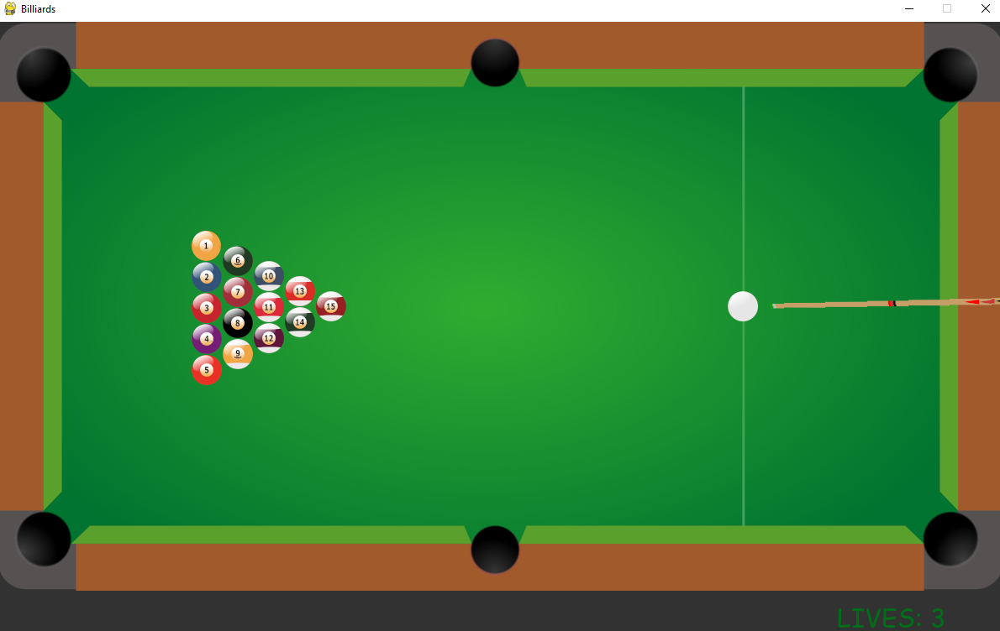

# Thomas' Billiards

## How to Play
- Your goal is to shoot all of the stripes and solids into the pockets
- Start off with three lives
- Potting the Cue Ball results in a lost of life
- Use  your mouse pointer to aim the cue stick
- Hold the left mouse button down and let go when desired power level is met
- Press 'Q' to quit